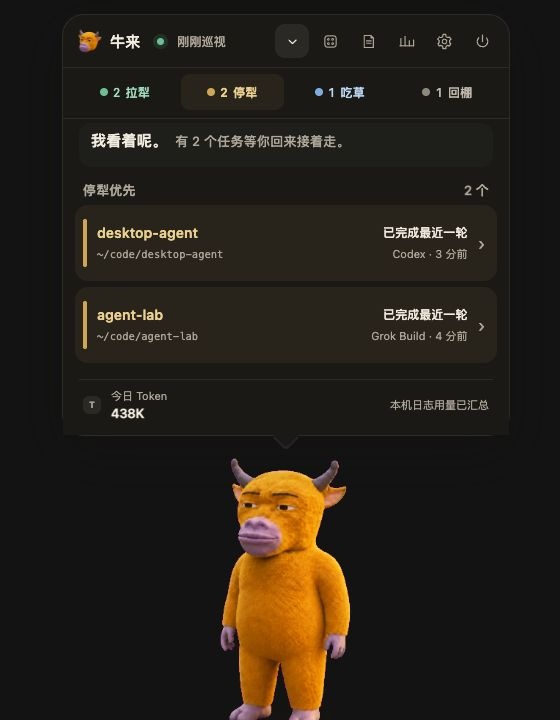
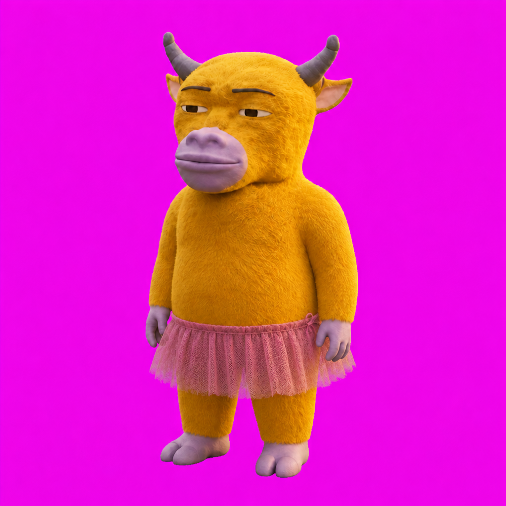
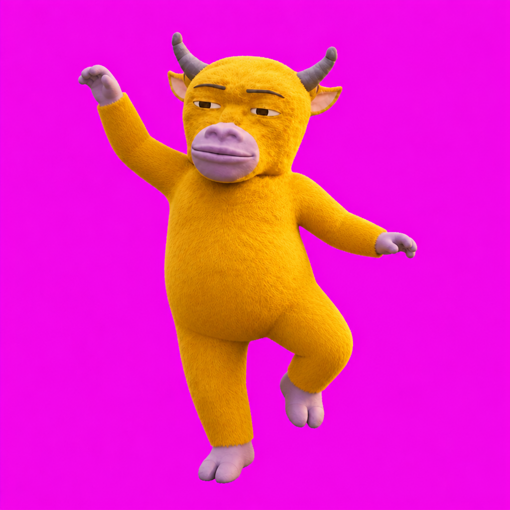
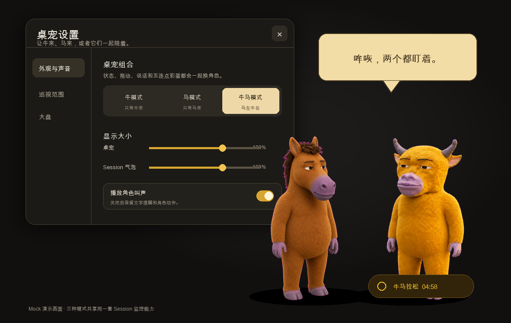
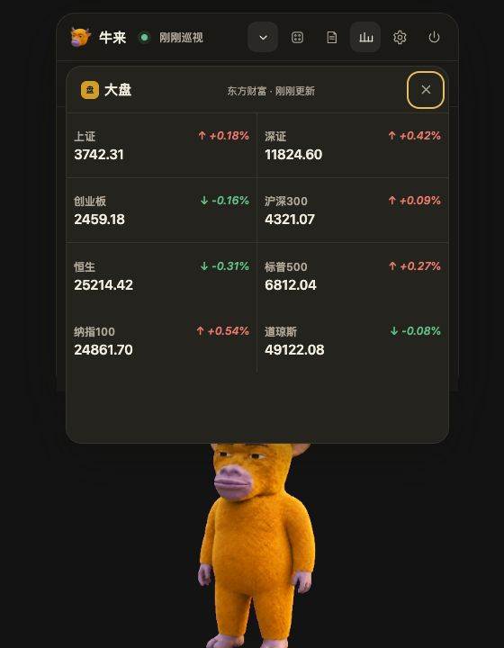
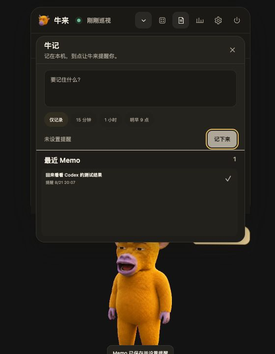

<p align="center">
  
</p>

<p align="center">
  <b>English</b> · <a href="README.md">简体中文</a>
</p>

<h1 align="center">Your agent won't knock when it's done. The cow will.</h1>

<p align="center">
  Niul.ai is a slightly janky yellow cow that lives on your macOS desktop.<br>
  It watches Cursor, Claude Code, Codex, and the rest—then tells you who is working and who is waiting.
</p>

<p align="center">
  <a href="https://github.com/adeptify/niul.ai/releases/latest"><b>Bring the cow home</b></a>
  ·
  <a href="#the-problem">Why it exists</a>
  ·
  <a href="#runtime-support">Runtime support</a>
  ·
  <a href="#run-from-source">Run from source</a>
</p>

<p align="center">
  If this saves you a few dozen context switches, feed the cow a ⭐.
</p>

<p align="center">
  
  <br>
  <sub>The screenshot uses mock data. It contains no real usernames, paths, sessions, or token records.</sub>
</p>

## The problem

You have Cursor working on one repo, Claude Code running in a terminal, Codex handling a second task, and one more agent that finished twelve minutes ago and has been waiting for approval ever since.

The models are capable. The human control loop is still mostly tab-hopping.

Niul.ai keeps the state of your local agent sessions at the edge of your desktop. No dashboard to manage, no browser tab to remember, and no need to reopen every terminal just to ask: *is it still working, or is it waiting for me?*

## Four states, one glance

Niul.ai translates runtime activity into four deliberately simple states:

- 🟢 **拉犁 · Plowing** — the agent is actively working
- 🔵 **停犁 · Waiting** — the turn is complete and the agent needs your input
- 🟡 **吃草 · Grazing** — the runtime is open, but this session is idle
- ⚫ **回棚 · Back in the barn** — the runtime is offline

The current app UI uses the Chinese labels above. They are cattle metaphors, not mysterious error codes.

## Built for an agent-heavy workflow

### Event-aware, not just “the file changed recently”

Where a runtime exposes meaningful lifecycle events, Niul.ai reads them. Cursor, Claude Code, Codex, and Grok Build can distinguish an active turn from a completed turn instead of treating every recent file write as “working.”

Runtimes without a stable event contract fall back to process state and a bounded activity window. Confidence varies by runtime because the available evidence varies.

See the [runtime monitoring plan](docs/runtime-monitoring.md) for paths, event rules, fallbacks, and known gaps.

### One click back to the right runtime

Click a session to focus its configured host app. CLI-only or custom runtimes may open the working directory instead. Niul.ai does not guess an app from the project name, so a repo called `codex` does not accidentally become an application target.

### Token counts without invented precision

Today’s token total only includes explicit usage metadata found in local runtime logs. Niul.ai does not estimate usage from prompt length, response text, or context-window size.

Explicit local usage metadata is currently imported for:

- Claude Code
- Codex
- Grok Build
- Gemini CLI

If a source is partial, the UI says so. If a runtime does not expose actual usage, Niul.ai leaves it out of the total.

### Ambient by design

This is not meant to become another observability console. The cow stays on top, can be collapsed to a small footprint, and uses restrained motion and short status lines to tell you when something changed.

Hover a session and the cow looks toward it. Drag the cow and it follows. Double-click it and, yes, you can pet it.

## The unnecessary features that are absolutely necessary

- **Roll the cow** — cycle through nine alternate outfits and poses
- **Cow, horse, or both** — switch between the cow, a right-facing animated horse, or a paired horse-left/cow-right layout
- **Quick Memo** — right-click to save a local note and optionally get reminded in 15 minutes, one hour, or tomorrow morning
- **Summon anywhere** — press `⌘⇧U` to show or hide Niul.ai
- **Status chatter** — optional animated and written reactions when agent state changes
- **Moo / Horse Marathon** — five clicks start the call that matches the current mode; in paired mode both characters join in

<p align="center">
  
  
  
  
  
</p>

### Meet Malai

One cow watching every agent felt a little lonely, so a horse showed up.

Malai is a full companion rather than a cow reskin: warm chestnut fuzz, a long face, unruly mane, half-lidded eyes, blinking, cursor-aware attention, animated speech, and a deliberately questionable synthesized neigh.

- **Cow mode:** Niul.ai alone, with the five-click Moo Marathon
- **Horse mode:** right-facing Malai alone, with an actual Horse Marathon
- **Cow + horse mode:** horse on the left, cow on the right, watching, speaking, and calling together

All three modes retain the same session monitoring, token usage, market, memo, dragging, petting, and reminder features. Switch modes from **Appearance & Sound**.

<p align="center">
  
  <br>
  <sub>Mock screen using the actual in-app cow and horse character assets.</sub>
</p>

There is also an optional market panel for eight major indices from mainland China, Hong Kong, and the US.

<p align="center">
  
  <br>
  <sub>The market screenshot uses mock data. Live public quotes may be delayed.</sub>
</p>

Market reactions never outrank agent state. Public quote data may be delayed, and the entire feature can be disabled in Settings.

### Quick Memo, with a cow attached

When something needs your attention later, right-click the cow or open **Quick Memo** from the header. Write one line, keep it as a local note, or ask the cow to remind you in 15 minutes, one hour, or tomorrow at 9:00.

When the time comes, the cow speaks up. Mark the memo done when you have handled it. Notes and reminders stay on your Mac.

<p align="center">
  
  <br>
  <sub>The screenshot uses mock content. Your actual notes and reminders stay on your Mac.</sub>
</p>

## Local-first

Session scanning, state classification, token accounting, and memos stay on your Mac.

Niul.ai requires:

- no account
- no cloud sync
- no analytics SDK
- no upload of session text, project paths, token records, or memos

When the optional market strip is enabled, the app requests public index quotes from its configured market provider. Those requests do not include your agent or project data.

## Runtime support

Niul.ai includes discovery rules for:

**Cursor · Claude Code · Claude Desktop · Codex · Grok Build · Gemini CLI · OpenCode · Pi · Aider · Continue · Windsurf · GitHub Copilot · Crush · Goose · Amp · Cline · Zed · Warp · ChatGPT**

Support depth varies with the evidence each tool exposes:

- **Event-level lifecycle detection:** Cursor, Claude Code, Codex, Grok Build
- **Explicit token usage import:** Claude Code, Codex, Grok Build, Gemini CLI
- **Session activity or process-level detection:** the remaining built-in runtimes

If your agent is not listed, add it from Settings with a name, a session directory, and an optional process name. A custom detector can walk bounded JSON/JSONL session trees without requiring a code change.

## Install

### Download the app

1. Open [GitHub Releases](https://github.com/adeptify/niul.ai/releases/latest).
2. Download `arm64` for Apple Silicon or `x64` for an Intel Mac.
3. Unzip the archive and move **牛来.app** into Applications.
4. On first launch, right-click the app in Finder and choose **Open**.

The current build is not signed with an Apple Developer ID, so macOS may block a normal double-click the first time. You do not need Node.js or a terminal when installing a release build.

Niul.ai may ask for Accessibility permission the first time it brings another runtime to the foreground.

### Run from source

Requirements: macOS and Node.js 18 or newer.

```bash
git clone https://github.com/adeptify/niul.ai.git
cd niul.ai
npm install
npm start
```

Run the test suite with:

```bash
npm test
```

The repository also includes [`安装牛来.command`](安装牛来.command), which installs to `~/Applications/牛来.app`. It prefers an existing build or GitHub release and only builds from source when necessary.

## Everyday controls

- **Click the cow:** expand or collapse the session bubble
- **Click a session:** bring its runtime to the foreground
- **Hover a session:** show the status reason and turn the cow toward it
- **Drag the cow:** move Niul.ai around the desktop
- **Double-click the cow:** pet it
- **Right-click the cow:** open Quick Memo
- **Press `⌘⇧U`:** show or hide the app
- **Open the gear:** choose runtimes, add a custom runtime, resize the cow and bubble, or configure market reactions
- **Open the power menu:** collapse, hide, or quit completely

By default, the list prioritizes sessions waiting for you. If it looks empty, switch to another state or check the enabled runtimes in Settings.

## Current limitations

- macOS only
- the app UI is currently in Chinese
- release builds are currently unsigned
- detector fidelity depends on what each runtime records locally
- token totals are local evidence, not a replacement for provider billing
- public market quotes can be delayed or temporarily unavailable

These constraints are explicit because “works with AI agents” should not mean “pretends every agent exposes the same telemetry.”

## Contributing

Bug fixes, runtime detectors, docs, tests, and new cows are welcome.

Start with [CONTRIBUTING.md](CONTRIBUTING.md). The important implementation paths are:

```text
config/runtimes.default.json   Built-in runtime catalog
electron/scan.js               Session discovery and state classification
electron/tokens.js             Local usage import and deduplication
electron/focus.js              Click-to-focus behavior
electron/market/               Optional market provider and reaction rules
renderer/                      Desktop pet UI and interaction
docs/runtime-monitoring.md     Detection coverage and evidence
```

Please run `npm test` before opening a pull request. If you change the UI, include a screenshot.

## License and character

The project code is available under the [MIT License](LICENSE).

The Niul.ai calf is a fan-made recreation inspired by the movie **牛来**. The short horns, half-lidded eyes, yellow fur, stiff movement, and homemade early-3D energy are intentional. It is not official artwork, and this project does not claim rights to the underlying film character.

---

You probably do not need another developer tool.

But if you are running six agents at once, you may need a cow.
