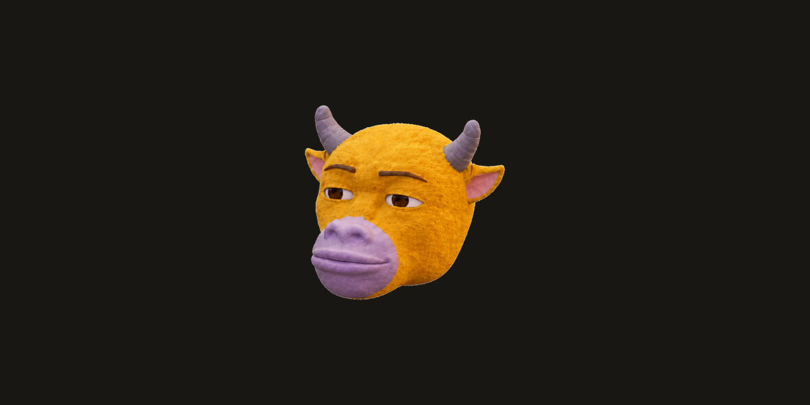
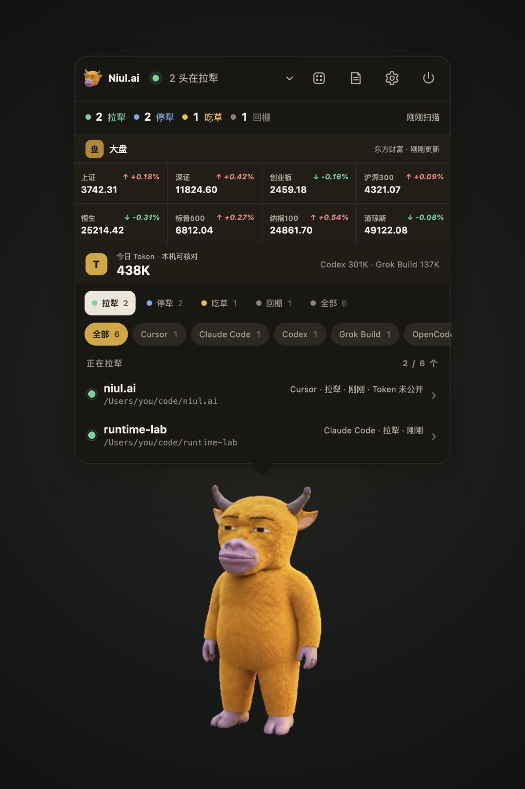

<p align="center">
  
</p>

<h1 align="center">AI 开了一堆，谁在干活？让牛来帮你盯着。</h1>

<p align="center">
  一头住在 macOS 桌面上的小黄牛，替你看本地 AI 谁在干活，也顺便瞄一眼中、港、美大盘。
</p>

<p align="center">
  它不写代码，只负责看谁在拉犁、谁在等你、今天烧了多少 Token，以及大盘有没有动静。
</p>

<p align="center">
  <a href="https://github.com/adeptify/niul.ai/releases/latest"><b>下载最新版</b></a>
  ·
  <a href="#它到底会干嘛">它会干嘛</a>
  ·
  <a href="#支持哪些-ai">支持哪些 AI</a>
</p>

<p align="center">
  喜欢它？顺手给牛加颗草：<b>Star ⭐</b>
</p>

<p align="center">
  
</p>

## 你开了一堆 AI，然后忘了它们在干嘛

同时开着好几个 AI 的时候，谁在干活、谁在等你，全凭猜。还有个等你确认的，已经等了二十分钟。

牛来浮在桌面最上层，把每个 AI 的状态翻译成一句牛话：

- 🟢 **拉犁**：正在工作
- 🔵 **停犁**：这轮做完了，在等你
- 🟡 **吃草**：还开着，但歇了
- ⚫ **回棚**：已经关了

**看一眼牛，就知道谁还在干活。**

## 它到底会干嘛

### 看一眼就全明白

不知道每个 Agent 在跑什么？不知道它是在干活还是等你？不知道今天又烧了多少 Token？懒得再开一个窗口看大盘？

牛全写在头顶的气泡里：Session 状态、Token 和 8 个主要指数。嫌乱，就只看还在干活的。

<p align="center">
  
  <br>
  <sub>Session、Token 与行情均为 Mock 演示数据，不包含真实用户名、目录或使用记录。</sub>
</p>

### 点谁，就去找谁

想回去接着干？点一下会话，窗口自己跳到你面前，不用你翻。

### 状态一变，它会说话

不用盯着终端刷。状态一变，牛自己开口：

> 哞，niul.ai 停犁了，正等你。

它也会眨眼，鼠标停在哪一项就看向哪一项；拖着走，它也乖乖跟着。

### 今天又烧了多少 Token

今天的 token 烧哪了？只算各家 AI 自己记的用量，不估数。

### 顺便替你瞄一眼大盘

展开气泡，就能直接看到上证、深证、创业板、沪深300、恒生、标普500、纳指100和道琼斯，不用自选，也不用再开一个行情窗口。

第一期行情来自东方财富免 Key 接口，可能存在延迟。指数跨过涨跌幅门槛时，牛会克制地说一句：

> 今天风有点大，纳指100涨到 +0.5%。

默认灵敏度是 `0.1%`，也可以改成 `0.5%` 或 `1%`；不想听它聊行情，就在设置里关闭反应或整个大盘。Agent 完成和等你始终优先，行情不会抢话。

### 一头牛不够，那就 Roll

看腻了？Roll 一下：原版、小裙子、头箍、书包、跳舞、足球……一共九头，每头都多少有点不正常。

<p align="center">
  
  
  
  
  
</p>

## ⚠️ 一些没必要，但不能没有的东西

- 单击牛：展开或收起名单
- 双击牛：摸一下
- 牛记：右键点一下，就能快速记一条便签，可选 15 分钟、1 小时或明早提醒
- `⌘⇧U`：随时召唤或隐藏
- 状态变化：牛会带着一声「哞」碎嘴播报

> [!CAUTION]
> **不要连续点击这头牛五下。**
>
> 除非你想让它进入持续五分钟的「哞拉松」：每隔几秒抬头张嘴、认真报时，继续哞。想停就再连点五下——前提是你还点得到它。

<p align="center">
  
</p>

## 本地优先

你的会话，只有你的电脑知道。不登录账号、不上传数据、不接第三方统计；看状态、算用量、记便签，全在本机完成。

打开大盘时，牛来只会向行情 Provider 请求公开指数，不会带走 Session、目录、便签或 Token 数据。它只是看起来不太聪明。

<details>
<summary><b>English</b></summary>

Niul.ai is a weirdly useful always-on-top macOS desktop pet. It watches local AI sessions across Cursor, Claude Code, Codex, Grok Build, and other runtimes, shows explicit local token usage, and glances at eight major China, Hong Kong, and US indices through a no-key Eastmoney feed. Agent status always takes priority over market reactions.

</details>

---

## 三分钟把牛牵回家 / Install

### 普通用户：直接下载 App

1. 打开 [GitHub Releases](https://github.com/adeptify/niul.ai/releases/latest)
2. Apple 芯片（M1 / M2 / M3 / M4）下载 `arm64`；Intel Mac 下载 `x64`
3. 解压 `.zip`，把「牛来」放进应用程序
4. 第一次启动请在 Finder 里对 App **右键 → 打开**

不需要 Node，不需要打开终端。当前构建尚未使用 Apple Developer ID 签名，因此直接双击可能被 macOS 拦住一次。

### 开发者：从源码启动 / Run from source

在**已经能执行 `node -v`** 的终端里（nvm 用户尤其要留意 PATH）：

```bash
git clone https://github.com/adeptify/niul.ai.git
cd niul.ai
npm install
npm start
```

需要 macOS 与 Node 18+。

### 从仓库一键安装

同一终端里：

```bash
zsh 安装牛来.command
```

也可以在 Finder 里打开 [`安装牛来.command`](安装牛来.command)。脚本会优先使用现有构建或 GitHub Release，没有可用产物时才从源码打包。

安装位置是 **`~/Applications/牛来.app`**，不是 `/Applications`。

### 装好之后 / After install

- 用 Spotlight 搜「牛来」，或打开 `~/Applications/牛来.app`
- 运行中按 **⌘⇧U** 显示或隐藏；电源菜单「隐藏桌宠」仍保留菜单栏和快捷键
- 「彻底退出」或重启后不会自动回来，需要再打开一次
- 当前构建没有 Apple Developer ID 签名。若打不开，在 Finder 里对 App **右键 → 打开**
- 第一次点会话跳过去时，macOS 可能要求给「辅助功能」权限（用来把窗口顶到前面）
- 默认只显示正在干活的 AI；列表是空的话，切到「全部」，或在齿轮里看看哪些 AI 没开

---

## 设置 / Settings

平时不用碰配置文件。点桌宠上的齿轮，就能开关要盯哪些 AI，或者加一个它不认识的——起个名字、指一下项目文件夹就行。大盘、行情反应和 `0.1%` / `0.5%` / `1%` 灵敏度也都在这里。想手写配置的开发者，见 [CONTRIBUTING.md](CONTRIBUTING.md)。

## 支持哪些 AI

它认识这些：Cursor · Claude Code · Claude Desktop · Codex · **Grok Build** · Gemini CLI · OpenCode · Pi · Aider · Continue · Windsurf · GitHub Copilot · Crush · Goose · Amp · Cline · Zed · Warp · ChatGPT

不认识的，在齿轮里加一个就行。还有些正在路上，完整方案见 [docs/runtime-monitoring.md](docs/runtime-monitoring.md)。

### 它怎么知道谁在干活

怎么判断谁在干活？优先看各家自己的运行记录，拿不到再看文件有没有动静。用量只认真实记录，思路参考了 [TokenStep](https://github.com/Backtthefuture/TokenStep) 和 [CC-Switch](https://github.com/farion1231/cc-switch)。

## 许可与形象 / License and likeness

牛来是一只二创的手搓感 3D 小黄牛桌宠：形象源自电影《牛来》，短角、半眯眼、动作有点僵，工作态度倒是很认真。

代码以 [MIT License](LICENSE) 开源。牛和角色形象是基于电影《牛来》的二次创作，不是官方素材，也不冒充官方。

Niul.ai and its calf character are fan-made recreations based on the movie 牛来 — not official assets.

## 最后

它可能不是你最需要的开发工具。

但当你同时开着六个 Agent 时，你会需要一头牛。

同事开得比你多？把页面转给他。
