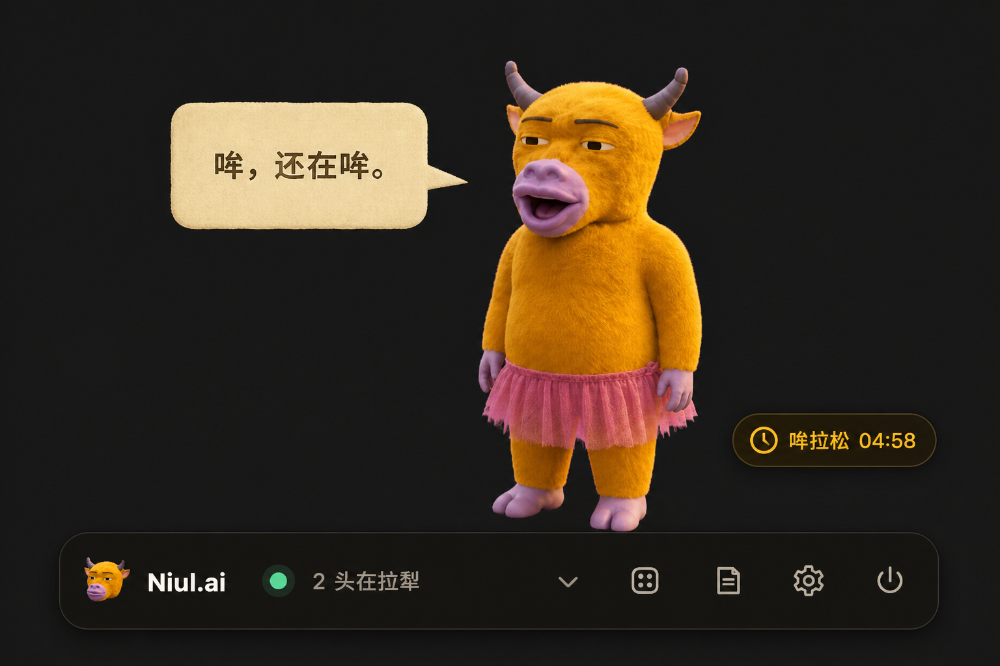

<p align="center">
  
</p>

<p align="center">
  <a href="README.en.md">English</a> · <b>简体中文</b>
</p>

<h1 align="center">Agent 干完了，不会敲你。牛会。</h1>

<p align="center">
  一头住在 macOS 桌面上的小黄牛，替你盯着 Cursor、Claude Code、Codex……<br>
  谁在拉犁、谁停下来等你，点一下就回到现场。
</p>

<p align="center">
  它不写代码，只负责看谁在干活、谁在摸鱼、今天烧了多少 Token，顺便瞄一眼中、港、美大盘。
</p>

<p align="center">
  <a href="https://github.com/adeptify/niul.ai/releases/latest"><b>把牛牵回 Mac</b></a>
  ·
  <a href="#它到底会干嘛">看看它怎么盯</a>
  ·
  <a href="#支持哪些-ai">支持哪些 AI</a>
</p>

<p align="center">
  觉得这头牛有点用？顺手给它添把草：<b>Star ⭐</b>
</p>

<p align="center">
  
  <br>
  <sub>画面使用 Mock 演示数据，不包含真实用户名、目录、Session 或 Token 记录。</sub>
</p>

## 你开了一堆 AI，然后忘了它们在干嘛

AI 可以同时干活，人不能同时盯六个窗口。

Cursor 在改页面，Claude Code 在跑测试，Codex 已经做完了，另一个 Agent 还等着你确认——二十分钟后，你才想起来它还开着。

牛来浮在桌面最上层，把每个 AI 的状态翻译成一句牛话：

- 🟢 **拉犁**：正在工作
- 🔵 **停犁**：这轮做完了，在等你
- 🟡 **吃草**：还开着，但歇了
- ⚫ **回棚**：已经关了

**不用巡逻所有窗口。看一眼牛，就知道该回谁那里。**

## 它到底会干嘛

### 先把等你的找出来

牛来默认把“停犁”的任务放在最前面。因为正在工作的可以继续干，已经关掉的也不着急；真正容易浪费时间的，是那个早就做完、却一直等你回去的 Agent。

气泡里会告诉你：

- 哪些 Agent 正在工作、等待、闲置或离线
- 它在哪个项目里，最后发生了什么
- 今天各家有明确记录的 Token 用量
- 最近一次巡视是什么时候

嫌信息多，可以按状态或 Runtime 筛选，只看现在最值得你处理的。

### 点谁，就去找谁

想回去接着干？点一下 Session，牛来会把对应 Runtime 的窗口带到你面前，不用自己在 Dock、终端和一堆桌面之间翻。

第一次跳转时，macOS 可能会请求“辅助功能”权限；它只用来把对应窗口带到前面。

### 状态一变，它会说话

不用盯着终端刷。状态一变，牛会自己开口：

> 哞，niul.ai 停犁了，正等你。

它也会眨眼。鼠标停在哪一项，它就转过去看哪一项；拖着走，它也乖乖跟着。嫌它碎嘴，可以关掉非必要播报。

### 今天又烧了多少 Token

今天的 Token 烧哪了？牛来只统计各家 AI 自己留下的明确 usage 元数据，不按 prompt 或回复字数估算，也不会为了好看编一个数字。

拿不到可靠用量时，它会直接说不知道。

### 顺便替你瞄一眼大盘

点开大盘，就能看到上证、深证、创业板、沪深 300、恒生、标普 500、纳指 100 和道琼斯。不用维护自选，也不用再开一个行情窗口。

<p align="center">
  
  <br>
  <sub>行情画面为 Mock 演示数据。实际行情来自东方财富免 Key 接口，可能存在延迟。</sub>
</p>

指数跨过你设置的涨跌幅门槛时，牛会克制地说一句：

> 今天风有点大，纳指 100 涨到 +0.5%。

默认灵敏度是 `0.1%`，也可以改成 `0.5%` 或 `1%`。不想听它聊行情，可以关闭行情反应，或者整个关掉大盘。

Agent 完成和等你始终优先，行情不会抢话。

### 随手记下，等牛来叫你

想到一件待会要做的事，不用先离开当前窗口找待办软件。右键点牛，或者打开顶栏里的“牛记”，写一句就行。

你可以选择仅保存在本机，也可以让牛在 15 分钟、1 小时或明早 9 点提醒。到点后它会开口叫你；处理完，勾一下就归档。

<p align="center">
  
  <br>
  <sub>牛记画面使用 Mock 演示内容；真实便签和提醒只保存在本机。</sub>
</p>

### 一头牛不够，那就 Roll

看腻了？Roll 一下：原版、小裙子、头箍、书包、跳舞、足球……一共九头，每头都多少有点不正常。

<p align="center">
  
  
  
  
  
</p>

## ⚠️ 一些没必要，但不能没有的东西

- **单击牛**：展开或收起名单
- **双击牛**：摸一下
- **拖动牛**：把它放到不挡工作的地方
- **右键牛**：打开“牛记”，快速记一条便签，可选 15 分钟、1 小时或明早提醒
- **`⌘⇧U`**：随时召唤或隐藏
- **状态变化**：牛会带着一声「哞」碎嘴播报

> [!CAUTION]
> **不要连续点击这头牛五下。**
>
> 除非你想让它进入持续五分钟的「哞拉松」：每隔几秒抬头张嘴、认真报时，继续哞。想停就再连点五下——前提是你还点得到它。

<p align="center">
  
</p>

## 本地优先

你的会话，只有你的电脑知道。

牛来不要求登录账号，不上传 Session、目录、Token 或便签，也不接第三方统计。状态判断、用量统计和牛记都留在本机完成。

打开大盘时，它只会向行情 Provider 请求公开指数，不会带走你的项目数据。它只是看起来不太聪明。

Looking for the full English version? Read the [English README](README.en.md).

---

## 三分钟把牛牵回家 / Install

### 普通用户：直接下载 App

1. 打开 [GitHub Releases](https://github.com/adeptify/niul.ai/releases/latest)
2. Apple 芯片（M1 / M2 / M3 / M4）下载 `arm64`；Intel Mac 下载 `x64`
3. 解压 `.zip`，把「牛来」放进应用程序
4. 第一次启动请在 Finder 里对 App **右键 → 打开**

不需要 Node，不需要打开终端。当前构建尚未使用 Apple Developer ID 签名，因此直接双击可能被 macOS 拦住一次。

### 开发者：从源码启动 / Run from source

在**已经能执行 `node -v`** 的终端里（nvm 用户尤其要留意 PATH）：

```bash
git clone https://github.com/adeptify/niul.ai.git
cd niul.ai
npm install
npm start
```

需要 macOS 与 Node 18+。

### 从仓库一键安装

同一终端里：

```bash
zsh 安装牛来.command
```

也可以在 Finder 里打开 [`安装牛来.command`](安装牛来.command)。脚本会优先使用现有构建或 GitHub Release，没有可用产物时才从源码打包。

安装位置是 **`~/Applications/牛来.app`**，不是 `/Applications`。

### 装好之后 / After install

- 用 Spotlight 搜「牛来」，或打开 `~/Applications/牛来.app`
- 运行中按 **⌘⇧U** 显示或隐藏；电源菜单「隐藏桌宠」仍保留菜单栏和快捷键
- 「彻底退出」或重启后不会自动回来，需要再打开一次
- 当前构建没有 Apple Developer ID 签名。若打不开，在 Finder 里对 App **右键 → 打开**
- 第一次点 Session 跳过去时，macOS 可能要求给「辅助功能」权限
- 默认优先显示正在等你的 AI；列表是空的话，切换其他状态，或在齿轮里看看哪些 AI 没开

---

## 设置 / Settings

平时不用碰配置文件。点桌宠上的齿轮，就能：

- 分别调整牛和 Session 气泡的大小
- 开关状态播报和碎嘴
- 选择要巡视哪些 AI Runtime
- 添加一个牛来暂时不认识的 Runtime
- 开关大盘、行情反应和 `0.1%` / `0.5%` / `1%` 灵敏度
- 切换深色或浅色外观

添加自定义 Runtime 时，起个名字、选择 Session 文件夹，再按需填写进程名即可。想手写配置的开发者，见 [CONTRIBUTING.md](CONTRIBUTING.md)。

## 支持哪些 AI

牛来认识这些：

Cursor · Claude Code · Claude Desktop · Codex · **Grok Build** · Gemini CLI · OpenCode · Pi · Aider · Continue · Windsurf · GitHub Copilot · Crush · Goose · Amp · Cline · Zed · Warp · ChatGPT

不认识的，在齿轮里加一个就行。还有些正在路上，完整方案见 [docs/runtime-monitoring.md](docs/runtime-monitoring.md)。

### 它怎么知道谁在干活

牛来优先读取各家 Runtime 自己留下的事件和运行记录；拿不到明确事件时，才退回到 Session 文件活动和进程状态。

因此不同 Runtime 的判断精度会有差别；牛来会优先展示能够确认的状态和依据，不把猜测装成确定事实。

用量只认真实记录，思路参考了 [TokenStep](https://github.com/Backtthefuture/TokenStep) 和 [CC-Switch](https://github.com/farion1231/cc-switch)。

## 许可与形象 / License and likeness

牛来是一只二创的手搓感 3D 小黄牛桌宠：形象源自电影《牛来》，短角、半眯眼、动作有点僵，工作态度倒是很认真。

代码以 [MIT License](LICENSE) 开源。牛和角色形象是基于电影《牛来》的二次创作，不是官方素材，也不冒充官方。

Niul.ai and its calf character are fan-made recreations based on the movie 牛来 — not official assets.

## 最后

它可能不是你最需要的开发工具。

但当你同时开着六个 Agent 时，你会需要一头牛。

同事开得比你多？把页面转给他。
